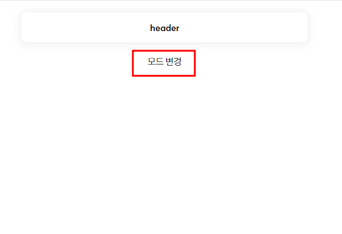
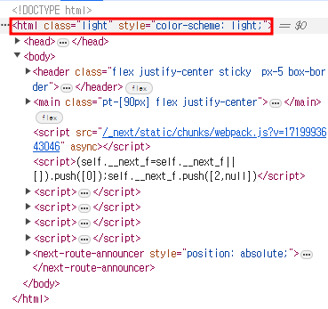
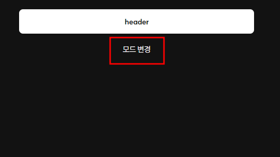
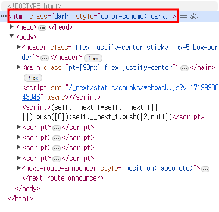

# 📁 다크모드 설정하기

## 🧩 next-themes 설치

`next-themes` 설치하기
```shell
$ npm install next-themes
```
<br />

## 🧩 ThemeProvider를 사용한 컴포넌트 만들기
`next-themes`에서 설치한 `ThemeProvider`모듈을 사용하여 컴포넌트 만들기
```javascript
// components/ThemeProvider.tsx
"use client";

import * as React from 'react';
import { ThemeProvider as NextThemesProvider } from 'next-themes';
import { type ThemeProviderProps } from 'next-themes/dist/types';

export default function ThemeProvider({ children, ...props }: ThemeProviderProps) {
    return <NextThemesProvider {...props}>{children}</NextThemesProvider>
}
```

## 🧩 테마 변경 컴포넌트 만들기
Theme를 변경시켜줄 eventHandler를 포함한 컴포넌트 만들기(버튼)

```javascript
// components/ThemeButton.tsx
"use client";

import React, { useState, useEffect } from 'react'
import { useTheme } from 'next-themes';

const ThemeButton = () => {
    const { theme, setTheme } = useTheme();
    const [mounted, setMounted] = useState(false);

    useEffect(() => {
        setMounted(true);
    })

    if (!mounted) {
        return <button type='button' disabled={true}></button>
    }

    const dark = theme === 'dark';

    return <button
                type='button' 
                onClick={() => setTheme(`${dark ? 'light' : 'dark'}`)}
            > 모드 변경
            </button>
};

export default ThemeButton;
```

## 🧩 버튼 배치하기
테마를 변경시키는 EventHandler를 가진 버튼을 배치
```javascript
import { Header, ThemeProvider, ThemeButton } from '@/components';


export default function RootLayout({
    children,
}: Readonly<{
    children: React.ReactNode;
}>) {
    return (
        <html>
            <body>
                <Header />
                <main>
                    {children}
                </main>
                <ThemeProvider attribute="class" enableSystem disableTransitionOnChange>
                    <ThemeButton />
                </ThemeProvider>
            </body>
        </html>
    );
}
```

### ThemeProviderProps 옵션
```javascript
// node_modules/next-themes/dist/types.d.ts
interface ThemeProviderProps {

    /** List of all available theme names */
    themes?: string[] | undefined;

    /** Forced theme name for the current page */
    forcedTheme?: string | undefined;

    /** Whether to switch between dark and light themes based on prefers-color-scheme */
    enableSystem?: boolean | undefined;

    /** Disable all CSS transitions when switching themes */
    disableTransitionOnChange?: boolean | undefined;

    /** Whether to indicate to browsers which color scheme is used (dark or light) for built-in UI like inputs and buttons */
    enableColorScheme?: boolean | undefined;

    /** Key used to store theme setting in localStorage */
    storageKey?: string | undefined;

    /** Default theme name (for v0.0.12 and lower the default was light). If `enableSystem` is false, the default theme is light */
    defaultTheme?: string | undefined;

    /** HTML attribute modified based on the active theme. Accepts `class` and `data-*` (meaning any data attribute, `data-mode`, `data-color`, etc.) */
    attribute?: string | 'class' | undefined;

    /** Mapping of theme name to HTML attribute value. Object where key is the theme name and value is the attribute value */
    value?: ValueObject | undefined;

    /** Nonce string to pass to the inline script for CSP headers */
    nonce?: string | undefined;

    /** React children */
    children: React.ReactNode;
}
```

# 📁다크모드 설정 결과

<div align="center">

&nbsp;

</div>

<div align="center">


</div>

추가로 tailwindcss를 사용한다면 tailwind.config파일에 다크모드를 인식할 수 있게 코드를 추가해줘야한다.
```javascript
import type { Config } from "tailwindcss";

const config: Config = {
  darkMode: 'class',
  // ...
}
```


