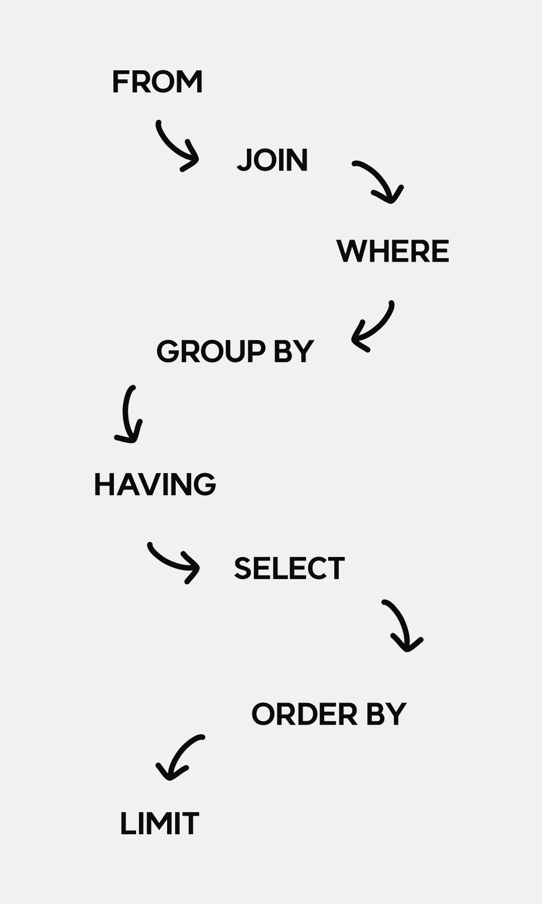

**sql의 실행 순서**는 구문을 작성하는데에 있어서 꼭 이해하고 있어야 하는 기본중의 하나다. 
sql구문의 실행 순서를 제대로 이해하지 못한 채 sql구문을 사용한다면 제대로 된 구문을 작성하지 
못할 뿐더러 유창하게 언어를 구사하지 못할 것이다.

<br />

# 📁 SQL 실행 순서(처리 과정)

<p align="center">

</p>

sql구문은 `FROM` &rarr; `JOIN` &rarr; `WHERE` &rarr; `GROUP BY` &rarr;
`HAVING` &rarr; `SELECT` &rarr; `ORDER BY` &rarr; `LIMIT` 순서로 실행된다.

## 🧩 SQL 실행 순서로 생긴 이슈

나는 이전에 sql 구문의 실행 순서를 이해하지 못하고 사용했던 적이 었었다. 항상 에러가 발생했지만 이것저것 지워보고 수정해 보는 식으로 작업을 해나갔었는데... 매우 비효율적이였다.


이전에 내가 작성했던 쿼리 구문이다.

```sql

SELECT `A_table`.*, 
`B_as`.`mem_nickname` AS `target_nickname` 
FROM `A_table` 
LEFT JOIN `B_table` AS `B_as` ON `B_as`.`mem_id` = `A_table`.`mem_id` 
WHERE `target_nickname` LIKE '%검색어%' ESCAPE '!'

```

에러 : `Unknown column 'target_nickname' in 'where clause'`.


컬럼명을 인식하지 못하는 에러였다.  
`SELECT` 절에서 생성한 별칭 `target_nickname`을 `WHERE`절에서 사용하여 에러가 난 것인데 
`WHERE`절 이후에 `SELECT`절이 실행되므로 `SELECT`에서 별칭으로 지정한 칼럼을 `WHERE`절에서 읽지 못하는 당연한 내용인데 이걸 몰라서...

# 마치며 

꼭 공부하자!


